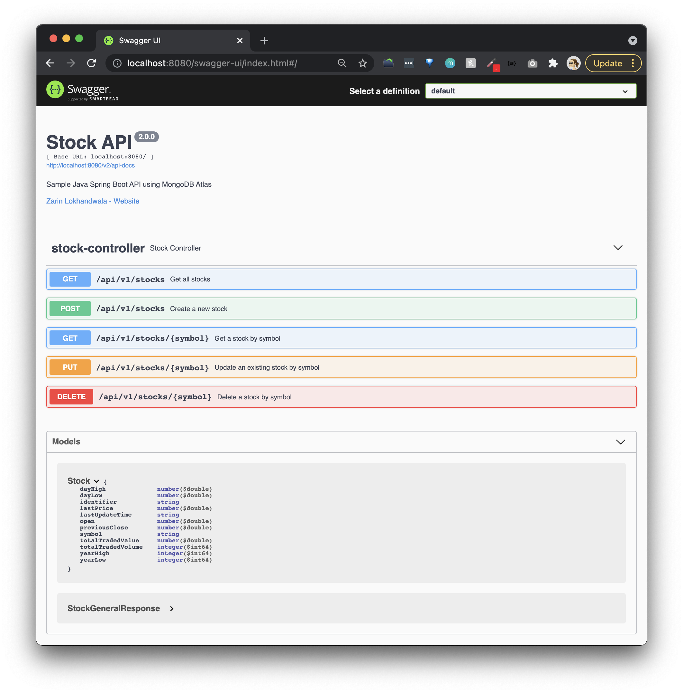

[](https://circleci.com/gh/zarinlo/sample-springboot-api/tree/master)
[](https://hub.docker.com/r/zarinlo/springboot-api)

# Sample Spring Boot API with MongoDB Repository 
- [Quick Intro](#quick-intro)
- [Software Required](#software-required)
- [Application Setup](#application-setup)
    * [Configurations](#configurations)
    * [Run the Backend](#run-the-backend)
        * [Windows](#windows)
        * [MacOS](#macos)
    * [UI Endpoints](#ui-endpoints)
        * [Spring Actuators](#spring-actuators)

# Quick Intro

This sample Java Springboot API will show how the following components function together: 
- Controller (manages all the REST calls and status codes)
- Service (business logic layer that handles any manipulation of data required)
- Repository (technically a JPA that allows one to query the database utilized by the Service)

The API used to populate the MongoDB once initialized is called "Latest Stock API": https://rapidapi.com/suneetk92/api/latest-stock-price/

The sample API key obtained for this demo is: `9e87a2c143msh6b92309e36af212p15ccc6jsn2bc37ea481bd`

The code snippet that populates the database and refreshes the data once a minute is as follows: 
```java
@Scheduled(fixedRate = 60000)
public void populateStockDatabase() throws StocksResponseException { ... }
``` 

In order to populate the database, you can either run MongoDB locally, or
use the embedded version via a Maven Dependency. To do so, please uncomment the following in the root 
`pom.xml` (you will see `Jackson Databind` errors, don't worry):

```java
<dependency>
    <groupId>de.flapdoodle.embed</groupId>
    <artifactId>de.flapdoodle.embed.mongo</artifactId>
    <version>3.0.0</version>
</dependency>
``` 

# Software Required
- [OpenJDK: 11.0.1](https://www.oracle.com/java/technologies/javase-downloads.html)
- [Apache Maven: 3.5.3](https://maven.apache.org/download.cgi)
- [MongoDB: 4.2](https://www.mongodb.com/download-center#community)

# Application Setup

## Configurations

- [Setuo local JDK under Project Settings and Structure - IntelliJ](https://www.jetbrains.com/help/idea/project-settings-and-structure.html)
- [Create Springboot Run Debug Configuration - IntelliJ](https://www.jetbrains.com/help/idea/run-debug-configuration.html) 
    * Under the configuration, there is an attribute called `Active profiles`, set this to `local` to utilize the 
    `application-local.yaml` on start up.

## Run the Backend

After you have your environment setup, run the application via the play button in the IDE: 

- [How to run the Springboot App - IntelliJ](https://www.jetbrains.com/help/idea/running-applications.html)

If you don't want to run the application from the IDE, then you can run it from a unix emulator (i.e. Git Bash, Cmder) or Terminal (MacOS).
Run the following bash commands in the root directory of this project: 

### Windows
```bash
mvnw.cmd clean install
mvnw.cmd spring-boot:run -Dspring-boot.run.arguments=--spring.profiles.active=local
```

### MacOS
```bash
./mvnw clean install
./mvnw spring-boot:run -Dspring-boot.run.arguments=--spring.profiles.active=local
```

## UI Endpoints

- Swagger UI: http://localhost:8080/swagger-ui.html

- API Spec: http://localhost:8080/v2/api-docs
    * extracted YAML and JSON files under `/src/main/resources/static` directory
- Stock Data: http://localhost:8080/api/v1/stocks

### Spring Actuators
- Health: http://localhost:8080/health
- Metrics: http://localhost:8080/metrics
- Http Trace: http://localhost:8080/httptrace
- Mappings: http://localhost:8080/mappings
